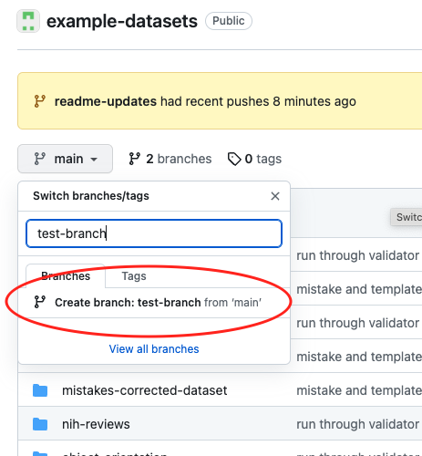
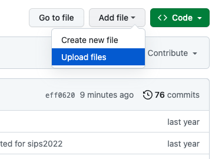
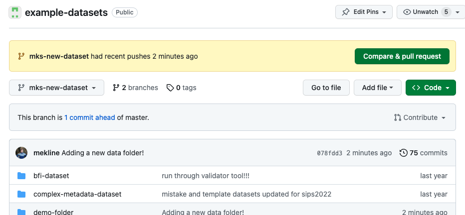
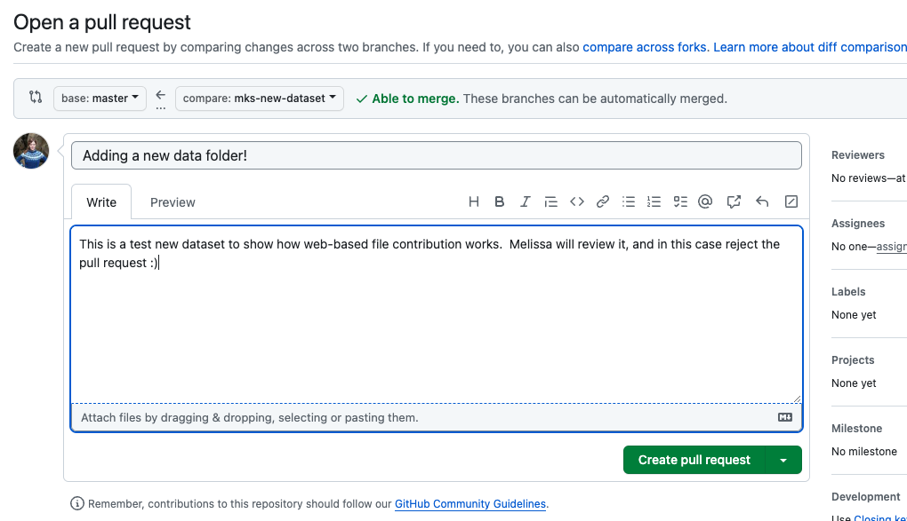

# Example Datasets for Psych-DS

This is a gallery of public datasets which have been formatted according to the (Psych-DS data specification)[https://psychds-docs.readthedocs.io/en/latest/guides/1_getting_started/]. They primarily come from various subfields of psychology, and at the moment (early 2025) are primarily either versions of datasets that are freely available elsewhere online, or templates designed to help people create new Psych-DS datasets.

You can browse them to learn more about how Psych-DS works, download a dataset to try out the [Psych-DS in-browser validator](https://psych-ds.github.io/validator/), or use them as test cases to develop tools that are designed to work with Psych-DS data.

*Note that there is one dataset in this repository that will *not* successfully validate: `informative-mistakes-dataset/`, because it is a small example designed to show various kinds of mistakes that will cause a dataset to fail validation. Check out its companion `mistakes-corrected-dataset/` for a version that passes validation!*

[anchor example](#anchor-name)

## List of datasets

#### Datasets designed for testing the specification

* Template, Complex-Metadata, Informative-Mistakes and Mistakes-Corrected datasets - Melissa Kline Struhl, updated by Brian Leonard
  
#### Real datasets contributed by researchers

* NIH reviews - Patrick S. Forscher
* Faces and Bodies - Lisa DeBruine
* BFI - Ioanna Iro Eleftheriadou
* Object Orientation - Sau-Chin Chen
* Macrophage Conditioning - Love Ahnström
* Safi Survey - Eduard Klapwijk

## How to contribute a dataset

BRIAN TO UPDATE

## More about Psych-DS

MKS TO UPDATE

*
*
*
*
*

# HISTORIC INFO - example-datasets

Here is how to contribute to this repository - any of the steps below will be tremendously helpful to us!

(1) **Try out a Psych-DS conversion:** Choose a dataset you are comfortable sharing publicly. First, make a *separate* copy of the dataset (so you maintain the original version), and follow the [How-To](https://docs.google.com/document/d/1k3ZzAF8vrJeIcMN3q5g_l7WJtoybokvq5ueYVH0dcC8/edit?usp=sharing) document to convert it to Psych-DS format. (You can also follow these instructions for a private dataset you don't intend to upload.) However far you get, leave comments on the google doc where the instructions aren't clear. We'll iterate so it provides *helpful* instructions for someone using the specification for the first time. 

(2) **Add datasets to this repository** by following the instructions below. If you like, add folders for both your originally structured data and the Psych-DS version - right now, both types are extremely helpful for us, because we are testing how the validator performs on different kinds of data. If you do this, please name your folders like this: `mydatasetname-original` and `mydatasetname-psychds`.

(3) **Get credit for your contributions:** If you contribute a dataset, make sure to also add yourself to the [list of guinea pig datasets](https://docs.google.com/spreadsheets/d/1QcfJqGPyBkdO0n4rCcye-Nfb3XWRYETOF3NMbwwPyJ4/edit?usp=sharing)!

Anyone can contribute to this project! Please have a look at the [Psych-DS code of conduct](https://github.com/psych-ds/psych-DS/blob/master/CODE_OF_CONDUCT.md) for our community guidelines, and feel free to email Melissa Kline Struhl (mekline@mit.edu) with any questions about the guinea pig datasets or Psych-DS more generally.  

# How to add to this repository

## (1) **Make a github account** 

...then contact Melissa (mekline@mit.edu) and she will give you access to contribute to this repository! Github is a wide-ranging suite of tools, but today you will be using it to drag and drop a single folder into your browser.  You will do this by

- Creating a *branch* (version of the repository)
- Adding your folder to this branch and saving your work
- Creating a *pull request*, which asks the creators of this repository to look at your branch, and merge the new changes into the main version of the repository.

## (2) Create a branch

When you first load this repository page, you are on the `main` branch.  To add something new to a github repository, the first step is to make a separate *branch* where you can make changes without worrying about changing the 'official' version in a way you didn't intend. 

Look under the name of the repository at the top of this page, where you should see a gray box labeled `main` on the lefthand side. This box tells you what branch you are currently looking at. Create a new branch by clicking on the arrow next to the word `main`, typing in a name for your new branch, and clicking to create the new branch. Use a descriptive name like `melissa-faces-dataset` to help us tell it apart from other branches.

## (3) Add your folder

Look at the grey box again - it should now show the name of your new branch, instead of `main`. Over on the right, you should see a button labeled "Add file".  Click the arrow, and choose the option to upload files:

This will open a new page with a place to drag and drop your folder. Once you drag it in, look underneath the file area, where you will see a list of the new files you have added, and below that, the box to `commit`, or save, these changes to your branch. 

Give your commit a short name and include any comments for us in the description box. Leave the button selected that says 'Commit directly to the `yourbranchname` branch' as it is, and click "Commit changes". 

## (4) Make a pull request

You will be returned to the main repository page, still on `yourbranchname` rather than `main`. There should now be a message right at the top with a button saying "Compare & pull request", which you should click.

This will take you to the pull request form.  At the top of this page, you will see two branch names, with an arrow showing what is happening: you are asking the `main` branch to review the changes on `yourbranchname` and pull them into the `main` branch. Again, give this a short name and a longer description if you like, then click "Create pull request". 

That's it! You will be taken to the pull request page, which will show your pull request along with any other open PRs:

We are notified automatically of new pull requests, so you won't need to anything else to let us know about it.  Keep an eye on your email or on this pull request URL - we will write comments back to you if we have any questions before merging your changes!

# Tips & resources

* [Article on the Schema.org Dataset structure](https://developers.google.com/search/docs/data-types/dataset). Click 'See Markup' under Examples for a pre-populated set of dataset JSON you can play with and validate against!

* [Maastricht Fair Data Wizard](https://maastrichtu-ids.github.io/fair-metadata-wizard/)

* Doomlab and rOpenSci dataspice apps

* Codebook by Ruben Arslan

* Probably many others! Please add to the How-To document when you use them!

* <a name="anchor-name">HOPEFULLY AN ANCHOR</a>

